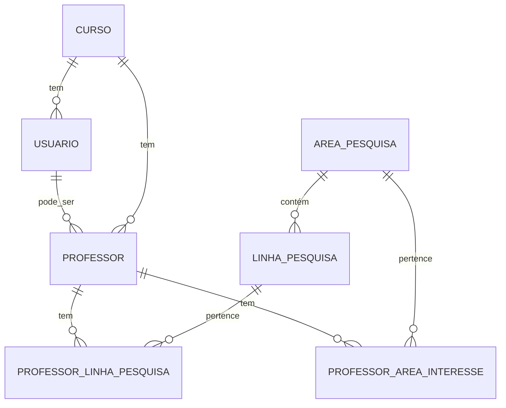

# DOCUMENTAÇÃO TÉCNICA - PesqHub

## 📋 Índice

### 📊 Engenharia de Software
1. [Documento de Requisitos](#documento-de-requisitos)
2. [Especificação Funcional](#especificação-funcional)
3. [Arquitetura e Design](#arquitetura-e-design)
4. [Plano de Testes](#plano-de-testes)

### 🛠️ Documentação Técnica
5. [Visão Geral do Sistema](#visão-geral-do-sistema)
6. [Arquitetura do Sistema](#arquitetura-do-sistema)
7. [Fluxo de Dados Principal](#fluxo-de-dados-principal)
8. [Documentação de API](#documentação-de-api)
9. [Documentação de Serviços](#documentação-de-serviços)
10. [Estrutura do Banco de Dados](#estrutura-do-banco-de-dados)
11. [Instalação e Configuração](#instalação-e-configuração)

---

## 📊 DOCUMENTAÇÃO DE ENGENHARIA DE SOFTWARE

## 📋 Documento de Requisitos

### Informações do Projeto

| Item | Descrição |
|------|-----------|
| **Produto** | PesqHub - Sistema de Gestão de Pesquisa Acadêmica |
| **Cliente** | UEFS - Universidade Estadual de Feira de Santana |
| **Versão** | 1.0.0 |
| **Data** | Novembro 2025 |
| **Equipe** | Equipe de Desenvolvimento PesqHub |

### Contexto e Justificativa

#### Problema Identificado
A UEFS possui diversos professores com linhas de pesquisa ativas, mas existe uma **dificuldade na comunicação** entre estudantes interessados em pesquisa e os professores orientadores. Estudantes frequentemente não conhecem todas as opções disponíveis, e professores podem não ter visibilidade adequada de seus trabalhos.

#### Solução Proposta
Desenvolvimento de uma **plataforma web centralizada** que:
- Permita aos professores cadastrar e gerenciar suas informações de pesquisa
- Facilite a busca e descoberta de oportunidades pelos estudantes
- Estabeleça canais de comunicação diretos e organizados
- Forneça ferramentas administrativas para gestão institucional

#### Benefícios Esperados
1. **Para Estudantes**: Facilita descoberta de oportunidades de pesquisa
2. **Para Professores**: Aumenta visibilidade e organiza demanda
3. **Para a Instituição**: Melhora gestão e acompanhamento da pesquisa
4. **Para o Processo Acadêmico**: Otimiza formação de parcerias orientador-orientando

---

## ✅ Requisitos Funcionais

### RF001 - Autenticação e Autorização
**Prioridade**: Alta | **Complexidade**: Média

**Descrição**: O sistema deve implementar autenticação segura com três níveis de acesso.

**Critérios de Aceitação**:
- [ ] Usuários podem se registrar com e-mail e senha
- [ ] Sistema autentica via credenciais ou integração Google
- [ ] Implementa três níveis: Administrador (SUPER), Organizador (DA), Estudante (BASICO)
- [ ] Administradores têm acesso completo ao sistema
- [ ] Organizadores gerenciam dados do seu curso
- [ ] Estudantes têm acesso apenas à consulta e contato
- [ ] Implementa logout seguro
- [ ] Sessões expiram após período de inatividade

### RF002 - Gestão de Perfis de Professores
**Prioridade**: Alta | **Complexidade**: Alta

**Descrição**: Permitir cadastro, edição e consulta de informações dos professores.

**Critérios de Aceitação**:
- [ ] Administradores e organizadores podem cadastrar professores
- [ ] Professores contêm: nome, e-mail, telefone, curso, departamento
- [ ] Professores podem ter múltiplas áreas de interesse
- [ ] Professores podem ter múltiplas linhas de pesquisa
- [ ] Sistema valida unicidade de e-mail
- [ ] Implementa soft delete para histórico
- [ ] Permite atualização em lote

### RF003 - Gestão de Linhas de Pesquisa
**Prioridade**: Alta | **Complexidade**: Média

**Descrição**: Gerenciar as linhas de pesquisa oferecidas pela instituição.

**Critérios de Aceitação**:
- [ ] Linhas possuem nome, descrição e área de pesquisa associada
- [ ] Organizadores podem criar/editar linhas do seu curso
- [ ] Administradores têm acesso completo
- [ ] Sistema impede exclusão de linhas com professores associados
- [ ] Implementa busca e filtros
- [ ] Mostra contagem de professores por linha

### RF004 - Gestão de Áreas de Pesquisa
**Prioridade**: Alta | **Complexidade**: Baixa

**Descrição**: Organizar as grandes áreas de pesquisa da instituição.

**Critérios de Aceitação**:
- [ ] Áreas possuem nome e descrição
- [ ] Hierarquia: Área → Linhas → Professores
- [ ] Sistema impede exclusão de áreas com dependências
- [ ] Administradores controlam criação/edição
- [ ] Interface de gestão intuitiva

### RF005 - Busca e Descoberta Pública
**Prioridade**: Alta | **Complexidade**: Média

**Descrição**: Permitir busca pública de professores e pesquisas.

**Critérios de Aceitação**:
- [ ] Busca por nome do professor
- [ ] Filtros por curso
- [ ] Filtros por área de interesse
- [ ] Busca por linhas de pesquisa
- [ ] Resultados paginados
- [ ] Interface responsiva
- [ ] Não requer autenticação

### RF006 - Visualização de Perfis
**Prioridade**: Alta | **Complexidade**: Baixa

**Descrição**: Exibir informações detalhadas dos professores.

**Critérios de Aceitação**:
- [ ] Modal/página com informações completas
- [ ] Lista linhas de pesquisa associadas
- [ ] Mostra áreas de interesse
- [ ] Informações de contato protegidas
- [ ] Interface amigável e informativa
- [ ] Botão para contato direto

### RF007 - Sistema de Contato
**Prioridade**: Alta | **Complexidade**: Média

**Descrição**: Facilitar comunicação entre estudantes e professores.

**Critérios de Aceitação**:
- [ ] Formulário de contato com validações
- [ ] E-mail automático para professor
- [ ] Campos obrigatórios: nome, e-mail, mensagem
- [ ] Proteção contra spam
- [ ] Template profissional de e-mail
- [ ] Confirmação de envio para estudante

### RF008 - Painel Administrativo
**Prioridade**: Média | **Complexidade**: Alta

**Descrição**: Interface completa para administração do sistema.

**Critérios de Aceitação**:
- [ ] Dashboard com métricas gerais
- [ ] CRUD completo de professores
- [ ] CRUD completo de linhas/áreas
- [ ] Gestão de usuários do sistema
- [ ] Relatórios e estatísticas
- [ ] Logs de atividades
- [ ] Interface moderna e intuitiva

### RF009 - Painel do Organizador
**Prioridade**: Média | **Complexidade**: Média

**Descrição**: Interface específica para organizadores de curso.

**Critérios de Aceitação**:
- [ ] Visão filtrada por curso do organizador
- [ ] Gestão de professores do curso
- [ ] Gestão de linhas do curso
- [ ] Métricas específicas do curso
- [ ] Permissões limitadas ao escopo

### RF010 - Dashboard do Estudante
**Prioridade**: Baixa | **Complexidade**: Baixa

**Descrição**: Painel personalizado para estudantes logados.

**Critérios de Aceitação**:
- [ ] Acesso rápido às funcionalidades principais
- [ ] Histórico de contatos realizados
- [ ] Favoritos/bookmarks de professores
- [ ] Recomendações personalizadas
- [ ] Perfil editável

### RF011 - Gestão de Usuários
**Prioridade**: Média | **Complexidade**: Média

**Descrição**: Administração dos usuários do sistema.

**Critérios de Aceitação**:
- [ ] Lista todos usuários cadastrados
- [ ] Ativação/desativação de contas
- [ ] Alteração de níveis de permissão
- [ ] Informações de último acesso
- [ ] Busca e filtros
- [ ] Auditoria de ações

### RF012 - Integração com Google Sheets
**Prioridade**: Baixa | **Complexidade**: Alta

**Descrição**: Sincronização opcional com planilhas Google.

**Critérios de Aceitação**:
- [ ] Importação inicial de dados
- [ ] Sincronização bidirecional
- [ ] Mapeamento de colunas configurável
- [ ] Logs de sincronização
- [ ] Tratamento de conflitos
- [ ] Backup automático

---

## 🚫 Requisitos Não Funcionais

### RNF001 - Performance
**Categoria**: Performance | **Prioridade**: Alta

**Métricas**:
- Tempo de resposta ≤ 2 segundos para 95% das requisições
- Tempo de carregamento inicial ≤ 3 segundos
- Suporte para 100 usuários simultâneos
- Cache eficiente com TTL apropriado

**Estratégias**:
- Cache de consultas frequentes (5 minutos)
- Otimização de consultas SQL
- CDN para assets estáticos
- Lazy loading em listas grandes

### RNF002 - Disponibilidade
**Categoria**: Confiabilidade | **Prioridade**: Alta

**Métricas**:
- Uptime ≥ 99% (máximo 7,2 horas de downtime/mês)
- RTO (Recovery Time Objective) ≤ 1 hora
- RPO (Recovery Point Objective) ≤ 1 hora

**Estratégias**:
- Monitoramento de saúde automático
- Backup diário automatizado
- Logs centralizados
- Alertas proativos

### RNF003 - Escalabilidade
**Categoria**: Performance | **Prioridade**: Média

**Métricas**:
- Arquitetura horizontal scaling ready
- Suporte para crescimento de 100% ao ano
- Banco de dados otimizado para ≥ 10.000 registros

**Estratégias**:
- Containerização com Docker
- Database indexing otimizado
- Separação de responsabilidades
- Microservices ready architecture

### RNF004 - Segurança
**Categoria**: Segurança | **Prioridade**: Alta

**Métricas**:
- Autenticação segura com hash bcrypt
- Proteção contra ataques OWASP Top 10
- Logs de segurança completos
- Validação rigorosa de inputs

**Estratégias**:
- HTTPS obrigatório
- CSRF protection
- XSS protection
- SQL injection prevention
- Rate limiting
- Session security

### RNF005 - Usabilidade
**Categoria**: Experiência do Usuário | **Prioridade**: Alta

**Métricas**:
- Interface intuitiva (≤ 3 cliques para ações principais)
- Responsividade em dispositivos móveis
- Acessibilidade WCAG 2.1 nível AA
- Suporte a navegadores principais

**Estratégias**:
- Design system consistente
- Progressive enhancement
- Touch-friendly interfaces
- Keyboard navigation
- Screen reader support

### RNF006 - Manutenibilidade
**Categoria**: Desenvolvimento | **Prioridade**: Média

**Métricas**:
- Cobertura de testes ≥ 80%
- Documentação técnica completa
- Code review obrigatório
- Padrões de coding estabelecidos

**Estratégias**:
- Arquitetura limpa (Clean Architecture)
- Testes automatizados (Unit, Feature, Integration)
- Documentação atualizada
- Logging estruturado
- Monitoramento de código

### RNF007 - Compatibilidade
**Categoria**: Interoperabilidade | **Prioridade**: Média

**Métricas**:
- Suporte a Chrome, Firefox, Safari, Edge (últimas 2 versões)
- Responsividade mobile (iOS/Android)
- APIs REST padronizadas
- Integração com sistemas externos

**Estratégias**:
- Progressive enhancement
- Feature detection
- Polyfills quando necessário
- API versioning
- Padrões web atuais

### RNF008 - Portabilidade
**Categoria**: Deployment | **Prioridade**: Média

**Métricas**:
- Deploy em múltiplos ambientes
- Configuração por environment variables
- Database agnóstico (PostgreSQL preferred)
- Container ready

**Estratégias**:
- Docker containerization
- Environment-based configuration
- Database abstraction layer
- Infrastructure as Code

---

## 🎯 Especificação Funcional

### Casos de Uso Principais

#### UC001 - Estudante Busca Professor
**Ator Principal**: Estudante  
**Pré-condições**: Acesso à internet  
**Pós-condições**: Lista de professores relevantes exibida

**Fluxo Principal**:
1. Estudante acessa a página inicial
2. Sistema exibe interface de busca
3. Estudante insere critérios (nome, curso, área)
4. Sistema processa busca e aplica filtros
5. Sistema retorna lista de professores
6. Estudante visualiza resultados

**Fluxos Alternativos**:
- **3a**: Nenhum critério informado → Sistema exibe todos os professores
- **5a**: Nenhum resultado encontrado → Sistema exibe mensagem apropriada

#### UC002 - Estudante Contata Professor
**Ator Principal**: Estudante  
**Pré-condições**: Professor selecionado  
**Pós-condições**: E-mail enviado com sucesso

**Fluxo Principal**:
1. Estudante clica em "Entrar em Contato"
2. Sistema exibe modal de contato
3. Estudante preenche formulário
4. Sistema valida dados
5. Sistema envia e-mail para professor
6. Sistema confirma envio

**Fluxos Alternativos**:
- **4a**: Dados inválidos → Sistema exibe erros e solicita correção
- **5a**: Falha no envio → Sistema exibe erro e permite nova tentativa

#### UC003 - Organizador Gerencia Professores
**Ator Principal**: Organizador  
**Pré-condições**: Login com nível DA, curso associado  
**Pós-condições**: Dados dos professores atualizados

**Fluxo Principal**:
1. Organizador acessa painel
2. Sistema exibe professores do curso
3. Organizador seleciona ação (criar/editar/excluir)
4. Sistema exibe formulário apropriado
5. Organizador preenche/modifica dados
6. Sistema valida e salva alterações
7. Sistema atualiza listagem

### Regras de Negócio

#### RN001 - Permissões por Nível
- **SUPER**: Acesso completo a todas funcionalidades
- **DA**: Acesso limitado aos dados do próprio curso
- **BASICO**: Apenas consulta e contato

#### RN002 - Validação de E-mails
- E-mails devem ser únicos no sistema
- Formato deve seguir padrão RFC 5322
- Domínios institucionais têm prioridade

#### RN003 - Relacionamentos Obrigatórios
- Professor deve ter pelo menos um curso
- Linha de pesquisa deve ter uma área associada
- Área não pode ser excluída se tiver linhas dependentes

#### RN004 - Proteção de Dados
- E-mails de professores não são exibidos publicamente
- Contato sempre intermediado pelo sistema
- Logs de contato para auditoria

#### RN005 - Cache e Performance
- Dados públicos cachados por 5 minutos
- Limpeza automática de cache após alterações
- Paginação obrigatória para listas > 50 itens

---

## 🏗️ Arquitetura e Design

### Arquitetura do Sistema

```
┌─────────────────────────────────────────────────────────────┐
│                        FRONTEND LAYER                       │
│  ┌─────────────┐  ┌─────────────┐  ┌─────────────────────┐  │
│  │   Public    │  │    Admin    │  │    Organizador      │  │
│  │  Interface  │  │  Dashboard  │  │    Dashboard        │  │
│  └─────────────┘  └─────────────┘  └─────────────────────┘  │
└─────────────────────────────────────────────────────────────┘
                              │
                              ▼
┌─────────────────────────────────────────────────────────────┐
│                    APPLICATION LAYER                        │
│  ┌──────────────┐ ┌──────────────┐ ┌─────────────────────┐  │
│  │     Auth     │ │   Business   │ │      External       │  │
│  │ Controllers  │ │ Controllers  │ │    Integration      │  │
│  └──────────────┘ └──────────────┘ └─────────────────────┘  │
└─────────────────────────────────────────────────────────────┘
                              │
                              ▼
┌─────────────────────────────────────────────────────────────┐
│                     SERVICE LAYER                           │
│  ┌──────────────┐ ┌──────────────┐ ┌─────────────────────┐  │
│  │  Database    │ │    Email     │ │    Google Sheets    │  │
│  │   Service    │ │   Service    │ │      Service        │  │
│  └──────────────┘ └──────────────┘ └─────────────────────┘  │
└─────────────────────────────────────────────────────────────┘
                              │
                              ▼
┌─────────────────────────────────────────────────────────────┐
│                      DATA LAYER                             │
│  ┌──────────────┐ ┌──────────────┐ ┌─────────────────────┐  │
│  │  PostgreSQL  │ │    Cache     │ │      External       │  │
│  │   Database   │ │   (Redis)    │ │       APIs          │  │
│  └──────────────┘ └──────────────┘ └─────────────────────┘  │
└─────────────────────────────────────────────────────────────┘
```

### Padrões de Design Utilizados

#### 1. MVC (Model-View-Controller)
- **Models**: Entidades de domínio (Professor, Usuario, LinhaPesquisa)
- **Views**: Templates Blade para renderização
- **Controllers**: Lógica de controle e coordenação

#### 2. Service Layer
- **DatabaseService**: Abstração para operações de dados
- **EmailService**: Gerenciamento de comunicações
- **GoogleSheetsService**: Integração externa

#### 3. Repository Pattern (Implícito via Eloquent)
- Abstração de acesso a dados
- Facilita testing e manutenção
- Eloquent ORM como implementação

#### 4. Dependency Injection
- Injeção automática via Laravel Container
- Facilita testes unitários
- Baixo acoplamento entre componentes

### Diagrama de Classes Principais

#### Estrutura das Entidades

```
┌─────────────────────────────────────────────────────────────────────┐
│                        ENTIDADES PRINCIPAIS                         │
└─────────────────────────────────────────────────────────────────────┘

┌─────────────────┐    ┌─────────────────┐    ┌─────────────────┐
│     USUARIO     │    │    PROFESSOR    │    │      CURSO      │
├─────────────────┤    ├─────────────────┤    ├─────────────────┤
│ • id (UUID)     │    │ • id (UUID)     │    │ • id (UUID)     │
│ • nome          │    │ • nome          │    │ • nome          │
│ • email         │    │ • email         │    │ • created_at    │
│ • senha         │    │ • telefone      │    │ • updated_at    │
│ • tipo_permissao│    │ • departamento  │    └─────────────────┘
│ • ativo         │    │ • id_curso (FK) │               ▲
│ • id_curso (FK) │    │ • criado_por    │               │
│ • created_at    │    │ • created_at    │               │
│ • updated_at    │    │ • updated_at    │               │
└─────────────────┘    └─────────────────┘               │
         │                       │                       │
         │                       └───────────────────────┘
         │                                              
         └──────────────────────────────────────────────┘

┌─────────────────┐              ┌─────────────────┐
│ LINHA_PESQUISA  │              │ AREA_PESQUISA  │
├─────────────────┤              ├─────────────────┤
│ • id (UUID)     │              │ • id (UUID)     │
│ • nome          │              │ • nome          │
│ • descricao     │              │ • descricao     │
│ • id_area (FK)  │──────────────│ • created_at    │
│ • criado_por    │              │ • updated_at    │
│ • created_at    │              └─────────────────┘
│ • updated_at    │                       ▲
└─────────────────┘                       │
         ▲                                 │
         │                                 │
         │        ┌─────────────────────────┘
         │        │
         │        │
    ┌────┴────────┴─────┐
    │   RELACIONAMENTOS   │
    │    MANY-TO-MANY    │
    └────────────────────┘
```

#### Relacionamentos

| Entidade A | Relacionamento | Entidade B | Tipo | Descrição |
|------------|---------------|------------|------|-----------|
| **Usuario** | pertence_a | **Curso** | N:1 | Usuário vinculado a um curso |
| **Professor** | leciona_em | **Curso** | N:1 | Professor pertence a um curso |
| **Professor** | trabalha_com | **LinhaPesquisa** | N:N | Professor pode ter múltiplas linhas |
| **LinhaPesquisa** | pertence_a | **AreaPesquisa** | N:1 | Linha vinculada a uma área |
| **Professor** | tem_interesse | **AreaPesquisa** | N:N | Professor pode ter múltiplas áreas |

#### Tabelas de Relacionamento (Many-to-Many)

```
┌─────────────────────────────────┐    ┌─────────────────────────────────┐
│    professor_linha_pesquisa     │    │    professor_area_interesse     │
├─────────────────────────────────┤    ├─────────────────────────────────┤
│ • id_professor (FK)             │    │ • id_professor (FK)             │
│ • id_linha_pesquisa (FK)        │    │ • area_pesquisa (FK)            │
│ • PRIMARY KEY (ambos)           │    │ • PRIMARY KEY (ambos)           │
└─────────────────────────────────┘    └─────────────────────────────────┘
```

### Fluxo de Dependências

```
AREA_PESQUISA
    │
    ├─→ LINHA_PESQUISA
    │       │
    │       └─→ PROFESSOR ←─── CURSO ←─── USUARIO
    │               │
    └───────────────┘
```

### Regras de Integridade

1. **Usuario** deve ter um **Curso** associado
2. **Professor** deve ter um **Curso** associado  
3. **LinhaPesquisa** deve ter uma **AreaPesquisa** associada
4. **AreaPesquisa** não pode ser excluída se tiver **LinhasPesquisa** dependentes
5. **Professor** não pode ser excluído se tiver relacionamentos ativos
6. E-mails devem ser únicos em **Usuario** e **Professor**

---

## 🧪 Plano de Testes

### Estratégia de Testes

#### Pirâmide de Testes
```
         ┌─────────────────┐
         │   E2E Tests     │ ← 10%
         │   (Selenium)    │
         └─────────────────┘
      ┌─────────────────────────┐
      │   Integration Tests     │ ← 20%
      │    (Feature Tests)      │
      └─────────────────────────┘
   ┌─────────────────────────────────┐
   │        Unit Tests               │ ← 70%
   │   (Services, Models, Utils)     │
   └─────────────────────────────────┘
```

### Tipos de Teste

#### 1. Testes Unitários (70%)
**Objetivo**: Testar componentes isolados

**Escopo**:
- Métodos de Services
- Models e relacionamentos
- Helpers e utilities
- Validações de negócio

**Ferramentas**: PHPUnit

**Exemplos**:
```php
class DatabaseServiceTest extends TestCase
{
    public function test_create_professor_with_valid_data()
    {
        $data = [
            'nome' => 'Dr. Teste',
            'email' => 'teste@uefs.br',
            'id_curso' => $this->curso->id
        ];
        
        $professor = $this->service->createProfessor($data);
        
        $this->assertNotNull($professor['id']);
        $this->assertEquals('Dr. Teste', $professor['nome']);
    }
    
    public function test_create_professor_with_duplicate_email_fails()
    {
        $this->expectException(ValidationException::class);
        
        // Teste de duplicação...
    }
}
```

#### 2. Testes de Integração (20%)
**Objetivo**: Testar interação entre componentes

**Escopo**:
- Endpoints de API
- Fluxos completos
- Integração com banco
- E-mail sending

**Ferramentas**: Laravel Feature Tests

**Exemplos**:
```php
class ProfessorApiTest extends TestCase
{
    public function test_admin_can_create_professor()
    {
        $admin = User::factory()->admin()->create();
        
        $response = $this->actingAs($admin)
            ->postJson('/admin/professores', [
                'nome' => 'Dr. Novo',
                'email' => 'novo@uefs.br',
                'id_curso' => $this->curso->id
            ]);
        
        $response->assertStatus(200)
                ->assertJson(['success' => true]);
    }
    
    public function test_organizador_cannot_access_other_course_data()
    {
        $organizador = User::factory()->organizador()->create();
        
        $response = $this->actingAs($organizador)
            ->getJson('/organizador/professores');
        
        $response->assertStatus(200);
        // Verificar filtros...
    }
}
```

#### 3. Testes End-to-End (10%)
**Objetivo**: Testar fluxos completos do usuário

**Escopo**:
- Jornadas críticas do usuário
- Funcionalidades principais
- Compatibilidade de browsers

**Ferramentas**: Laravel Dusk

**Exemplos**:
```php
class StudentJourneyTest extends DuskTestCase
{
    public function test_student_can_search_and_contact_professor()
    {
        $this->browse(function (Browser $browser) {
            $browser->visit('/')
                    ->type('search-filter', 'João')
                    ->waitFor('.organizador-card')
                    ->click('.organizador-card:first-child')
                    ->waitFor('#organizador-profile-modal')
                    ->click('button:contains("Entrar em Contato")')
                    ->type('[name="nome"]', 'Estudante Teste')
                    ->type('[name="email"]', 'estudante@test.com')
                    ->type('[name="mensagem"]', 'Interesse em pesquisa')
                    ->click('button[type="submit"]')
                    ->waitForText('E-mail enviado com sucesso');
        });
    }
}
```

### Cenários de Teste Críticos

#### CT001 - Autenticação e Autorização
- **Login válido/inválido**
- **Níveis de permissão**
- **Session timeout**
- **Logout seguro**

#### CT002 - Gestão de Professores
- **CRUD completo**
- **Validações de dados**
- **Relacionamentos**
- **Permissões por nível**

#### CT003 - Busca e Contato
- **Busca com filtros**
- **Resultados relevantes**
- **Envio de e-mail**
- **Validações de formulário**

#### CT004 - Performance e Carga
- **Tempo de resposta**
- **Carga simultânea**
- **Cache functionality**
- **Database optimization**

### Critérios de Aceitação dos Testes

#### Cobertura Mínima
- **Código geral**: ≥ 80%
- **Services críticos**: ≥ 95%
- **Controllers**: ≥ 85%
- **Models**: ≥ 90%

#### Performance
- **Testes unitários**: < 2 minutos total
- **Testes integração**: < 10 minutos total
- **Testes E2E**: < 30 minutos total

#### Qualidade
- **Zero falhas em produção crítica**
- **Testes determinísticos (não flaky)**
- **Documentação de casos edge**
- **Mocks apropriados para dependências externas**

---

## 🎯 Visão Geral do Sistema

### Objetivo
O **PesqHub** é um sistema web desenvolvido para a UEFS (Universidade Estadual de Feira de Santana) que facilita a conexão entre alunos e professores para projetos de pesquisa, orientações de TCC e colaborações acadêmicas.

### Funcionalidades Principais
- **Busca de Professores**: Alunos podem buscar professores por áreas de interesse e linhas de pesquisa
- **Gestão de Pesquisa**: Professores gerenciam suas linhas de pesquisa e áreas de interesse
- **Sistema de Contato**: Comunicação facilitada entre alunos e professores
- **Administração**: Painel administrativo para gestão completa do sistema

### Tecnologias Utilizadas
- **Backend**: Laravel 11
- **Banco de Dados**: PostgreSQL
- **Frontend**: Blade Templates + JavaScript Vanilla
- **Containerização**: Docker + Docker Compose
- **E-mail**: SMTP (configurável)

---

## 🏗️ Arquitetura do Sistema

### Estrutura de Camadas

```
┌─────────────────────────────────────────┐
│               FRONTEND                  │
│  (Blade Templates + JavaScript)         │
└─────────────────────────────────────────┘
                    ↓
┌─────────────────────────────────────────┐
│              CONTROLLERS                │
│  (AuthController, AdminController, etc) │
└─────────────────────────────────────────┘
                    ↓
┌─────────────────────────────────────────┐
│               SERVICES                  │
│  (DatabaseService, EmailService, etc)  │
└─────────────────────────────────────────┘
                    ↓
┌─────────────────────────────────────────┐
│                MODELS                   │
│  (Professor, Usuario, LinhaPesquisa)    │
└─────────────────────────────────────────┘
                    ↓
┌─────────────────────────────────────────┐
│              DATABASE                   │
│             (PostgreSQL)                │
└─────────────────────────────────────────┘
```

### Principais Módulos

#### 1. **Módulo de Autenticação**
- **Controllers**: `AuthController`
- **Middleware**: `CheckUserLevel`
- **Funcionalidades**: Login, logout, registro, níveis de acesso
- **Níveis de Permissão**:
  - `SUPER` (Administrador): Acesso completo
  - `DA` (Organizador): Gestão de professores e pesquisas do seu curso
  - `BASICO` (Estudante): Consulta e contato

#### 2. **Módulo de Professores**
- **Models**: `Professor`, `AreaPesquisa`, `LinhaPesquisa`
- **Controllers**: `AdminController`, `OrganizadorController`
- **Services**: `DatabaseService`
- **Funcionalidades**: CRUD de professores, áreas e linhas de pesquisa

#### 3. **Módulo de Usuários**
- **Models**: `Usuario`, `Curso`
- **Services**: `DatabaseService`, `UserService`
- **Funcionalidades**: Gestão de usuários, perfis, permissões

#### 4. **Módulo de Comunicação**
- **Controllers**: `EmailController`
- **Services**: `EmailService`
- **Funcionalidades**: Envio de e-mails, contato entre usuários

#### 5. **Módulo Público**
- **Controllers**: `HomeController`
- **Views**: `home.blade.php`
- **Funcionalidades**: Busca pública de professores e linhas de pesquisa

### Relacionamentos Entre Entidades



---

## 🔄 Fluxo de Dados Principal

### Fluxo Completo do Estudante

```
1. CADASTRO/LOGIN
   ↓
2. BUSCA PROFESSORES
   ├─ Por Nome
   ├─ Por Curso
   └─ Por Área de Interesse
   ↓
3. VISUALIZA PERFIL DO PROFESSOR
   ├─ Informações Básicas
   ├─ Áreas de Interesse
   └─ Linhas de Pesquisa
   ↓
4. ENVIA CONTATO
   ├─ Formulário de Contato
   ├─ Validação de Dados
   └─ Envio por E-mail
   ↓
5. AGUARDA RESPOSTA
```

### Fluxo do Organizador/Professor

```
1. LOGIN COM PERMISSÃO 'DA'
   ↓
2. ACESSA PAINEL ORGANIZADOR
   ↓
3. GERENCIA DADOS
   ├─ Professores do seu Curso
   ├─ Áreas de Pesquisa
   └─ Linhas de Pesquisa
   ↓
4. RECEBE CONTATOS
   └─ E-mails dos Estudantes
```

### Fluxo do Administrador

```
1. LOGIN COM PERMISSÃO 'SUPER'
   ↓
2. ACESSA PAINEL ADMIN
   ↓
3. GERENCIA SISTEMA COMPLETO
   ├─ Todos os Professores
   ├─ Todas as Áreas/Linhas
   ├─ Usuários do Sistema
   └─ Configurações Gerais
```

---

## 📡 Documentação de API

### OpenAPI (Swagger) Specification

```yaml
openapi: 3.0.3
info:
  title: PesqHub API
  description: API para sistema de gestão de pesquisa acadêmica da UEFS
  version: 1.0.0
  contact:
    name: Equipe PesqHub
    email: admin@pesqhub.com

servers:
  - url: http://localhost:8001
    description: Ambiente de desenvolvimento

paths:
  # =================== ROTAS PÚBLICAS ===================
  
  /api/data:
    get:
      tags:
        - Público
      summary: Obter dados públicos de professores e linhas de pesquisa
      description: Retorna lista de professores e linhas de pesquisa para exibição pública
      responses:
        '200':
          description: Dados obtidos com sucesso
          content:
            application/json:
              schema:
                type: object
                properties:
                  professores:
                    type: array
                    items:
                      $ref: '#/components/schemas/Professor'
                  linhas_pesquisa:
                    type: array
                    items:
                      $ref: '#/components/schemas/LinhaPesquisa'
                  success:
                    type: boolean
                    example: true
        '500':
          description: Erro interno do servidor

  /contact-organizador:
    post:
      tags:
        - Comunicação
      summary: Enviar contato para professor
      description: Enviar e-mail de contato de estudante para professor
      requestBody:
        required: true
        content:
          application/json:
            schema:
              type: object
              required:
                - email_professor
                - nome_professor
                - nome_estudante
                - email_estudante
                - mensagem
              properties:
                email_professor:
                  type: string
                  format: email
                nome_professor:
                  type: string
                nome_estudante:
                  type: string
                email_estudante:
                  type: string
                  format: email
                mensagem:
                  type: string
                  minLength: 5
                assunto:
                  type: string
      responses:
        '200':
          description: E-mail enviado com sucesso
        '422':
          description: Dados inválidos
        '500':
          description: Erro no envio

  # =================== ROTAS ADMINISTRATIVAS ===================
  
  /admin/professores:
    get:
      tags:
        - Admin - Professores
      summary: Listar todos os professores
      security:
        - AdminAuth: []
      responses:
        '200':
          description: Lista de professores
          content:
            application/json:
              schema:
                type: object
                properties:
                  data:
                    type: array
                    items:
                      $ref: '#/components/schemas/Professor'
                  success:
                    type: boolean
    
    post:
      tags:
        - Admin - Professores
      summary: Criar novo professor
      security:
        - AdminAuth: []
      requestBody:
        required: true
        content:
          application/json:
            schema:
              $ref: '#/components/schemas/ProfessorInput'
      responses:
        '200':
          description: Professor criado com sucesso
        '422':
          description: Dados inválidos
        '500':
          description: Erro na criação

  /admin/professores/{id}:
    put:
      tags:
        - Admin - Professores
      summary: Atualizar professor
      security:
        - AdminAuth: []
      parameters:
        - name: id
          in: path
          required: true
          schema:
            type: string
            format: uuid
      requestBody:
        required: true
        content:
          application/json:
            schema:
              $ref: '#/components/schemas/ProfessorInput'
      responses:
        '200':
          description: Professor atualizado com sucesso
        '404':
          description: Professor não encontrado
        '422':
          description: Dados inválidos

    delete:
      tags:
        - Admin - Professores
      summary: Excluir professor
      security:
        - AdminAuth: []
      parameters:
        - name: id
          in: path
          required: true
          schema:
            type: string
            format: uuid
      responses:
        '200':
          description: Professor excluído com sucesso
        '404':
          description: Professor não encontrado
        '409':
          description: Não é possível excluir (relacionamentos existentes)

  /admin/linhas-pesquisa:
    get:
      tags:
        - Admin - Linhas de Pesquisa
      summary: Listar linhas de pesquisa
      security:
        - AdminAuth: []
      responses:
        '200':
          description: Lista de linhas de pesquisa
    
    post:
      tags:
        - Admin - Linhas de Pesquisa
      summary: Criar linha de pesquisa
      security:
        - AdminAuth: []
      requestBody:
        required: true
        content:
          application/json:
            schema:
              type: object
              required:
                - nome
                - id_area_pesquisa
              properties:
                nome:
                  type: string
                  maxLength: 255
                descricao:
                  type: string
                id_area_pesquisa:
                  type: string
                  format: uuid
      responses:
        '200':
          description: Linha criada com sucesso

  /admin/areas-pesquisa:
    get:
      tags:
        - Admin - Áreas de Pesquisa
      summary: Listar áreas de pesquisa
      security:
        - AdminAuth: []
      responses:
        '200':
          description: Lista de áreas de pesquisa

  /admin/usuarios:
    get:
      tags:
        - Admin - Usuários
      summary: Listar usuários do sistema
      security:
        - AdminAuth: []
      responses:
        '200':
          description: Lista de usuários

  # =================== ROTAS DE ORGANIZADOR ===================
  
  /organizador/professores:
    get:
      tags:
        - Organizador - Professores
      summary: Listar professores do curso do organizador
      security:
        - OrganizadorAuth: []
      responses:
        '200':
          description: Lista filtrada de professores

# =================== SCHEMAS ===================

components:
  securitySchemes:
    AdminAuth:
      type: http
      scheme: bearer
      description: Token de autenticação para administradores
    OrganizadorAuth:
      type: http
      scheme: bearer
      description: Token de autenticação para organizadores

  schemas:
    Professor:
      type: object
      properties:
        id:
          type: string
          format: uuid
          example: "550e8400-e29b-41d4-a716-446655440000"
        nome:
          type: string
          example: "Dr. João Silva"
        email:
          type: string
          format: email
          example: "joao.silva@uefs.br"
        telefone:
          type: string
          example: "(75) 99999-0001"
        curso:
          type: string
          example: "Ciência da Computação"
        departamento:
          type: string
          example: "DTEC"
        linhas_pesquisa:
          type: array
          items:
            type: object
            properties:
              id:
                type: string
                format: uuid
              nome:
                type: string
        areas_interesse:
          type: array
          items:
            type: object
            properties:
              id:
                type: string
                format: uuid
              nome:
                type: string

    ProfessorInput:
      type: object
      required:
        - nome
        - email
        - id_curso
      properties:
        nome:
          type: string
          maxLength: 255
        email:
          type: string
          format: email
          maxLength: 255
        telefone:
          type: string
          maxLength: 20
        id_curso:
          type: string
          format: uuid
        departamento:
          type: string
          maxLength: 255
        areas_interesse_ids:
          type: array
          items:
            type: string
            format: uuid
        linhas_pesquisa_ids:
          type: array
          items:
            type: string
            format: uuid

    LinhaPesquisa:
      type: object
      properties:
        id:
          type: string
          format: uuid
        nome:
          type: string
        descricao:
          type: string
        area_pesquisa:
          type: string
        professores_count:
          type: integer

    Error:
      type: object
      properties:
        error:
          type: string
        success:
          type: boolean
          example: false
```

---

## 🛠️ Documentação de Serviços

### DatabaseService

**Arquivo**: `app/Services/DatabaseService.php`

```php
<?php

namespace App\Services;

/**
 * Serviço principal para operações de banco de dados do PesqHub
 * 
 * Este serviço centraliza todas as operações de banco de dados da aplicação,
 * fornecendo uma camada de abstração entre os controllers e os models.
 * Implementa cache para melhor performance e logging para auditoria.
 * 
 * @package App\Services
 * @author Equipe PesqHub
 * @version 1.0.0
 */
class DatabaseService
{
    // Constantes de níveis de permissão do sistema
    const NIVEL_ADMIN = 'SUPER';
    const NIVEL_ORGANIZADOR = 'DA';
    const NIVEL_BASICO = 'BASICO';

    // =============== PROFESSORES ===============

    /**
     * Obtém lista completa de professores com relacionamentos
     * 
     * Retorna todos os professores cadastrados no sistema com suas
     * respectivas áreas de interesse, linhas de pesquisa e curso.
     * Os dados são armazenados em cache por 5 minutos para otimizar performance.
     * 
     * @return array Lista de professores com todos os relacionamentos
     * @throws \Exception Em caso de erro na consulta ao banco
     * 
     * @example
     * ```php
     * $professores = $databaseService->getProfessores();
     * foreach ($professores as $professor) {
     *     echo $professor['nome'] . ' - ' . $professor['curso'];
     * }
     * ```
     */
    public function getProfessores()

    /**
     * Obtém dados completos de um professor específico
     * 
     * Busca um professor pelo ID incluindo todos os relacionamentos
     * (curso, linhas de pesquisa, áreas de interesse).
     * 
     * @param string $id UUID do professor
     * @return array Dados completos do professor
     * @throws \Exception Se professor não encontrado ou erro na consulta
     */
    public function getProfessorById($id)

    /**
     * Cria um novo professor no sistema
     * 
     * Insere um novo professor no banco de dados e estabelece
     * os relacionamentos com áreas de interesse e linhas de pesquisa.
     * Utiliza transação para garantir consistência dos dados.
     * 
     * @param array $data Dados do professor
     * @param array $data['nome'] Nome completo do professor
     * @param array $data['email'] E-mail institucional
     * @param array $data['telefone'] Telefone de contato (opcional)
     * @param array $data['id_curso'] UUID do curso
     * @param array $data['departamento'] Departamento (opcional)
     * @param array $data['areas_interesse_ids'] Array de UUIDs das áreas
     * @param array $data['linhas_pesquisa_ids'] Array de UUIDs das linhas
     * @return array Dados do professor criado
     * @throws \Exception Em caso de erro na criação
     */
    public function createProfessor($data)

    /**
     * Atualiza dados de um professor existente
     * 
     * @param string $id UUID do professor
     * @param array $data Novos dados do professor
     * @return array Dados atualizados do professor
     * @throws \Exception Se professor não encontrado ou erro na atualização
     */
    public function updateProfessor($id, $data)

    /**
     * Remove um professor do sistema
     * 
     * Exclui um professor e todos os seus relacionamentos.
     * Verifica dependências antes da exclusão.
     * 
     * @param string $id UUID do professor
     * @return bool True em caso de sucesso
     * @throws \Exception Se não for possível excluir ou erro na operação
     */
    public function deleteProfessor($id)

    // =============== LINHAS DE PESQUISA ===============

    /**
     * Obtém todas as linhas de pesquisa com contagem de professores
     * 
     * @return array Lista de linhas de pesquisa
     * @throws \Exception Em caso de erro na consulta
     */
    public function getLinhasPesquisa()

    /**
     * Cria nova linha de pesquisa
     * 
     * @param array $data Dados da linha de pesquisa
     * @param array $data['nome'] Nome da linha
     * @param array $data['descricao'] Descrição (opcional)
     * @param array $data['id_area_pesquisa'] UUID da área de pesquisa
     * @return array Dados da linha criada
     * @throws \Exception Em caso de erro na criação
     */
    public function createLinhaPesquisa($data)

    /**
     * Atualiza linha de pesquisa existente
     * 
     * @param string $id UUID da linha
     * @param array $data Novos dados
     * @return array Dados atualizados
     * @throws \Exception Em caso de erro na atualização
     */
    public function updateLinhaPesquisa($id, $data)

    /**
     * Remove linha de pesquisa
     * 
     * @param string $id UUID da linha
     * @return bool True em caso de sucesso
     * @throws \Exception Se houver professores associados ou erro na operação
     */
    public function deleteLinhaPesquisa($id)

    // =============== ÁREAS DE PESQUISA ===============

    /**
     * Obtém todas as áreas de pesquisa
     * 
     * @return array Lista de áreas de pesquisa
     * @throws \Exception Em caso de erro na consulta
     */
    public function getAreasPesquisa()

    /**
     * Cria nova área de pesquisa
     * 
     * @param array $data Dados da área
     * @param array $data['nome'] Nome da área
     * @param array $data['descricao'] Descrição (opcional)
     * @return array Dados da área criada
     * @throws \Exception Em caso de erro na criação
     */
    public function createAreaPesquisa($data)

    // =============== USUÁRIOS ===============

    /**
     * Obtém usuário por e-mail para autenticação
     * 
     * @param string $email E-mail do usuário
     * @return array|null Dados do usuário ou null se não encontrado
     * @throws \Exception Em caso de erro na consulta
     */
    public function getUserByEmail($email)

    /**
     * Obtém todos os usuários do sistema
     * 
     * @return array Lista de usuários
     * @throws \Exception Em caso de erro na consulta
     */
    public function getUsers()

    /**
     * Ativa um usuário no sistema
     * 
     * @param string $id UUID do usuário
     * @return bool True em caso de sucesso
     * @throws \Exception Em caso de erro na operação
     */
    public function ativarUsuario($id)

    /**
     * Desativa um usuário no sistema
     * 
     * @param string $id UUID do usuário
     * @return bool True em caso de sucesso
     * @throws \Exception Em caso de erro na operação
     */
    public function desativarUsuario($id)

    // =============== CURSOS ===============

    /**
     * Obtém todos os cursos disponíveis
     * 
     * @return array Lista de cursos com contagem de professores e usuários
     * @throws \Exception Em caso de erro na consulta
     */
    public function getCursos()
}
```

### EmailService

**Arquivo**: `app/Services/EmailService.php`

```php
<?php

namespace App\Services;

/**
 * Serviço de envio de e-mails do PesqHub
 * 
 * Gerencia todos os tipos de e-mail da aplicação, incluindo
 * contatos entre usuários, confirmações de cadastro e notificações.
 * 
 * @package App\Services
 */
class EmailService
{
    /**
     * Envia e-mail de contato de estudante para professor
     * 
     * @param array $data Dados do e-mail
     * @param string $data['email_professor'] E-mail de destino
     * @param string $data['nome_professor'] Nome do professor
     * @param string $data['nome_estudante'] Nome do estudante
     * @param string $data['email_estudante'] E-mail do estudante
     * @param string $data['mensagem'] Conteúdo da mensagem
     * @param string $data['assunto'] Assunto do e-mail (opcional)
     * @return bool True em caso de sucesso
     * @throws \Exception Em caso de erro no envio
     */
    public function enviarContatoProfessor($data)

    /**
     * Envia e-mail de confirmação de cadastro
     * 
     * @param string $email E-mail de destino
     * @param string $nome Nome do usuário
     * @param string $token Token de confirmação
     * @return bool True em caso de sucesso
     * @throws \Exception Em caso de erro no envio
     */
    public function enviarConfirmacaoCadastro($email, $nome, $token)
}
```

---

## 🗄️ Estrutura do Banco de Dados

### Tabelas Principais

#### usuarios
```sql
CREATE TABLE usuarios (
    id UUID PRIMARY KEY DEFAULT uuid_generate_v4(),
    nome VARCHAR(255) NOT NULL,
    email VARCHAR(255) UNIQUE NOT NULL,
    senha VARCHAR(255) NOT NULL,
    tipo_permissao VARCHAR(50) NOT NULL,  -- 'SUPER', 'DA', 'BASICO'
    ativo BOOLEAN DEFAULT true,
    id_curso UUID REFERENCES cursos(id),
    created_at TIMESTAMP DEFAULT CURRENT_TIMESTAMP,
    updated_at TIMESTAMP DEFAULT CURRENT_TIMESTAMP
);
```

#### professores
```sql
CREATE TABLE professores (
    id UUID PRIMARY KEY DEFAULT uuid_generate_v4(),
    nome VARCHAR(255) NOT NULL,
    email VARCHAR(255) UNIQUE NOT NULL,
    telefone VARCHAR(20),
    id_curso UUID REFERENCES cursos(id),
    departamento VARCHAR(255),
    criado_por UUID REFERENCES usuarios(id),
    created_at TIMESTAMP DEFAULT CURRENT_TIMESTAMP,
    updated_at TIMESTAMP DEFAULT CURRENT_TIMESTAMP
);
```

#### linhas_pesquisa
```sql
CREATE TABLE linhas_pesquisa (
    id UUID PRIMARY KEY DEFAULT uuid_generate_v4(),
    nome VARCHAR(255) NOT NULL,
    descricao TEXT,
    id_area_pesquisa UUID REFERENCES areas_pesquisa(id),
    criado_por UUID REFERENCES usuarios(id),
    created_at TIMESTAMP DEFAULT CURRENT_TIMESTAMP,
    updated_at TIMESTAMP DEFAULT CURRENT_TIMESTAMP
);
```

#### areas_pesquisa
```sql
CREATE TABLE areas_pesquisa (
    id UUID PRIMARY KEY DEFAULT uuid_generate_v4(),
    nome VARCHAR(255) NOT NULL,
    descricao TEXT,
    created_at TIMESTAMP DEFAULT CURRENT_TIMESTAMP,
    updated_at TIMESTAMP DEFAULT CURRENT_TIMESTAMP
);
```

#### cursos
```sql
CREATE TABLE cursos (
    id UUID PRIMARY KEY DEFAULT uuid_generate_v4(),
    nome VARCHAR(255) NOT NULL,
    created_at TIMESTAMP DEFAULT CURRENT_TIMESTAMP,
    updated_at TIMESTAMP DEFAULT CURRENT_TIMESTAMP
);
```

### Tabelas de Relacionamento

#### professor_linha_pesquisa
```sql
CREATE TABLE professor_linha_pesquisa (
    id_professor UUID REFERENCES professores(id) ON DELETE CASCADE,
    id_linha_pesquisa UUID REFERENCES linhas_pesquisa(id) ON DELETE CASCADE,
    PRIMARY KEY (id_professor, id_linha_pesquisa)
);
```

#### professor_area_interesse
```sql
CREATE TABLE professor_area_interesse (
    id_professor UUID REFERENCES professores(id) ON DELETE CASCADE,
    area_pesquisa UUID REFERENCES areas_pesquisa(id) ON DELETE CASCADE,
    PRIMARY KEY (id_professor, area_pesquisa)
);
```

---

## 🚀 Instalação e Configuração

### Pré-requisitos
- Docker e Docker Compose
- Git

### Configuração Inicial

1. **Clone o repositório**
```bash
git clone [repository-url]
cd pesq-hub
```

2. **Configure o ambiente**
```bash
cp .env.example .env
# Edite o .env com suas configurações
```

3. **Configure as credenciais do Google Sheets**
```bash
# Coloque o arquivo credenciais.json em storage/app/
```

4. **Inicie os containers**
```bash
docker-compose up -d --build
```

5. **Execute as migrações**
```bash
docker-compose exec app php artisan migrate
```

6. **Popule dados iniciais** (opcional)
```bash
docker-compose exec app php artisan sheets:init
docker-compose exec app php artisan app:migrate-from-sheets
```

### Configurações Importantes

#### Arquivo .env
```bash
# Aplicação
APP_NAME=PesqHub
APP_ENV=local
APP_KEY=base64:...
APP_DEBUG=true
APP_URL=http://localhost:8001

# Banco de Dados
DB_CONNECTION=pgsql
DB_HOST=db
DB_PORT=5432
DB_DATABASE=pesq_hub
DB_USERNAME=root
DB_PASSWORD=root

# Google Sheets
GOOGLE_CLIENT_ID=your-client-id
GOOGLE_CLIENT_SECRET=your-client-secret
GOOGLE_REDIRECT_URI=http://localhost:8001/google/callback
GOOGLE_APPLICATION_CREDENTIALS=credenciais.json
GOOGLE_SHEET_ID=your-sheet-id

# E-mail
MAIL_MAILER=smtp
MAIL_HOST=smtp-relay.brevo.com
MAIL_PORT=587
MAIL_USERNAME=your-smtp-username
MAIL_PASSWORD=your-smtp-password
MAIL_ENCRYPTION=tls
MAIL_FROM_ADDRESS="noreply@pesqhub.com"
MAIL_FROM_NAME="PesqHub - UEFS"
```

### Estrutura de Pastas

```
pesq-hub/
├── app/
│   ├── Console/Commands/          # Comandos Artisan
│   ├── Http/
│   │   ├── Controllers/          # Controllers da aplicação
│   │   └── Middleware/           # Middleware personalizado
│   ├── Mail/                     # Classes de e-mail
│   ├── Models/                   # Models Eloquent
│   ├── Providers/               # Service Providers
│   └── Services/               # Serviços da aplicação
├── config/                     # Configurações do Laravel
├── database/
│   ├── migrations/            # Migrações do banco
│   └── seeders/              # Seeders
├── docker/                   # Configurações Docker
├── public/                   # Arquivos públicos
├── resources/
│   ├── css/                 # Estilos CSS
│   ├── js/                  # Scripts JavaScript
│   └── views/               # Templates Blade
├── routes/                  # Definição de rotas
├── storage/                 # Storage do Laravel
└── docker-compose.yml      # Configuração Docker Compose
```

### Comandos Úteis

```bash
# Ver logs da aplicação
docker-compose logs -f app

# Executar comandos Artisan
docker-compose exec app php artisan [command]

# Acessar container da aplicação
docker-compose exec app bash

# Reiniciar containers
docker-compose restart

# Parar todos os containers
docker-compose down

# Rebuild completo
docker-compose down && docker-compose up -d --build
```

---

## 📞 Suporte

Para dúvidas e suporte técnico:
- **Documentação**: Este arquivo
- **E-mail**: pesqhub@gmail.com

---

**Versão**: 1.0.0  
**Data**: Novembro 2025  
**Equipe**: PesqHub Development Team
